# viaConstructor
## Documentation
* Setup-Options
	- [Mill](#mill)
	- [Tool](#tool)
	- [Workpiece](#workpiece)
	- [Pockets](#pockets)
	- [Tabs](#tabs)
	- [Leads](#leads)
	- [Machine](#machine)
	- [View](#view)

## Mill
### Active

enable/disable this object

* Default: True

### Depth

the end depth for milling

* Unit: mm/inch
* Default: -9.0

### Step

the maximum depth in one move

* Unit: mm/inch
* Default: -9.0

### Start-Depth

the start depth for milling

* Unit: mm/inch
* Default: 0.0

### Passes

number of passes in Laser-Mode

* Default: 1

### Helix

milling circles in helix mode

* Default: False

### Fast-Move Z

the Z-Position for fast moves

* Unit: mm/inch
* Default: 5.0

### G64-Value

value for the G64 command

* Default: 0.02

### Reverse

Reverse

* Default: False

### Back-Home

move tool back to Zero-Possition after milling

* Default: True

### Small-Circles

milling small circles even if the tool is bigger

* Default: False

### Overcut

Overcuting edges

* Default: False

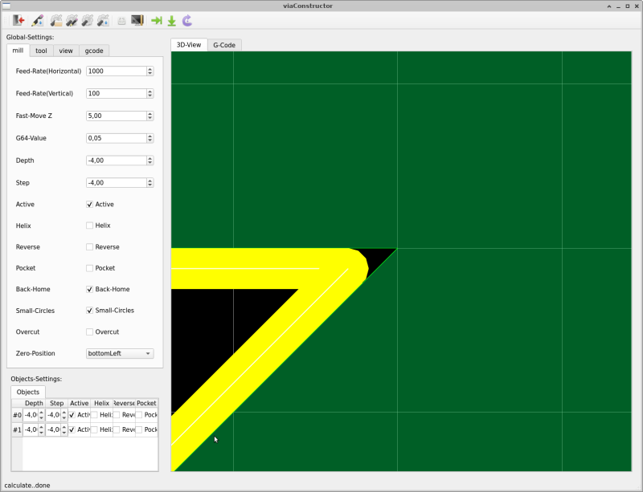

### Offset

tool offset

* Default: auto
### Options:
* auto
* inside
* outside
* none

### Object-Order

how order the objects

* Default: nearest
### Options:
* nearest
* unordered
* per object

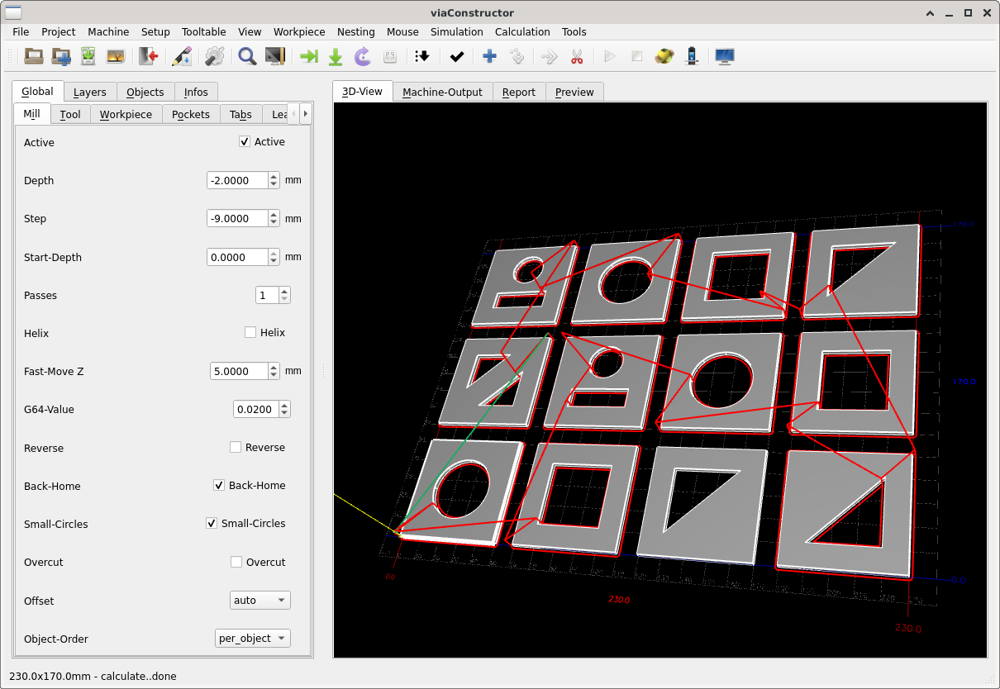

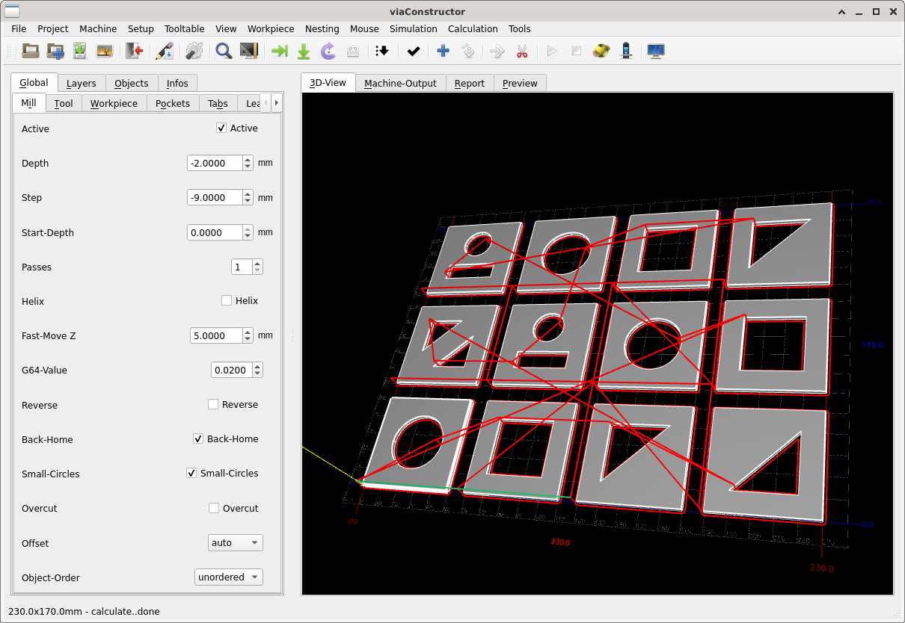

## Tool
### Number

setting the Tool-Number to load in gcode

* Default: 1

### Speed

setting the Tool-Speed in RPM

* Unit: RPM
* Default: 10000

### Feed-Rate(Horizontal)

the Horizotal Feetrate

* Unit: mm/min
* Default: 1000

### Feed-Rate(Vertical)

the Vertical Feetrate

* Unit: mm/min
* Default: 100

### Pause

tool spin up time (G04 Pn)

* Unit: s
* Default: 3

### Mist

activate mist

* Default: False

### Flood

activate flood

* Default: False

### Tools

the tooltable

## Workpiece
### Zero-Position

setting the Zero-Postition of the Workpiece

* Default: bottomLeft
### Options:
* original
* bottom left
* center
* bottom right
* top left
* top right

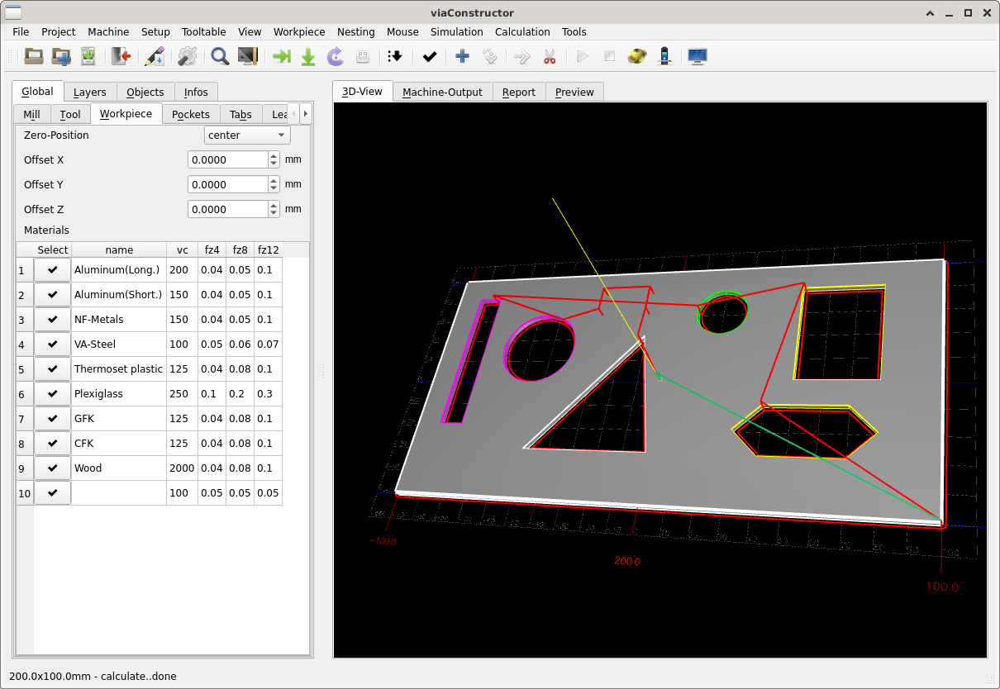

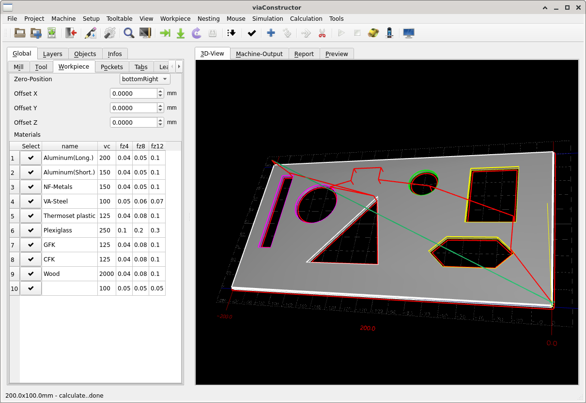

### Offset X

Offset X (G54)

                    if G54 support is true, workpiece offsets will set with G10 command:
                     G10 L2 P1 X10.000000 Y20.000000 Z3.000000 (workpiece offsets for G54)
                    if G54 support is false, all offsets added to the G0-G3 commands
                

* Unit: mm/inch
* Default: 0.0

### Offset Y

Offset Y (G54)

                    if G54 support is true, workpiece offsets will set with G10 command:
                     G10 L2 P1 X10.000000 Y20.000000 Z3.000000 (workpiece offsets for G54)
                    if G54 support is false, all offsets added to the G0-G3 commands
                

* Unit: mm/inch
* Default: 0.0

### Offset Z

Offset Z (G54)

                    if G54 support is true, workpiece offsets will set with G10 command:
                     G10 L2 P1 X10.000000 Y20.000000 Z3.000000 (workpiece offsets for G54)
                    if G54 support is false, all offsets added to the G0-G3 commands
                

* Unit: mm/inch
* Default: 0.0

### Materials

the materialtable

                    list of predifined materials to calculate feedrate / tool speed
                

## Pockets
### Pocket

do pocket operation on this object

* Default: False

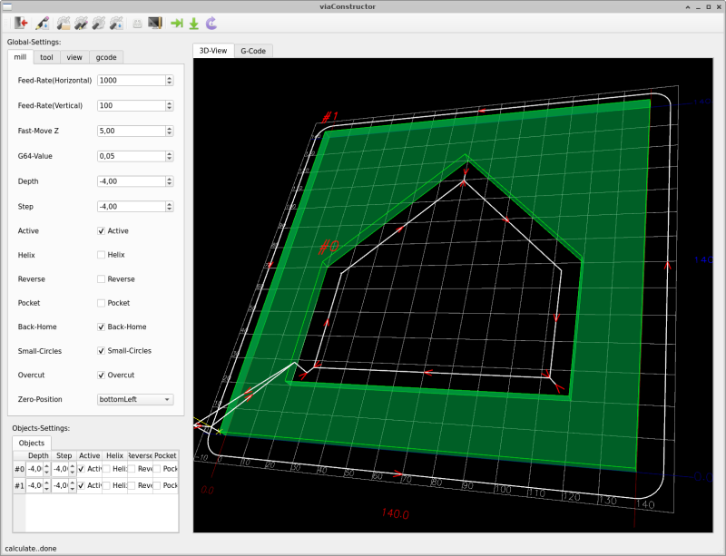

### Zigzag

Zigzag

* Default: False

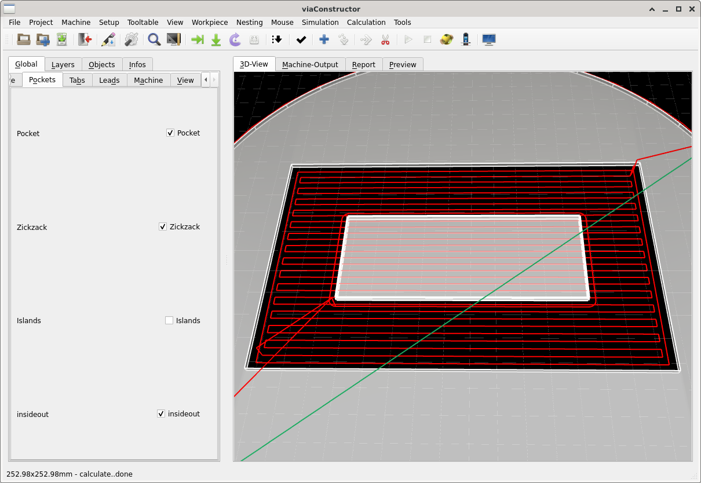

### Islands

keep islands

* Default: True

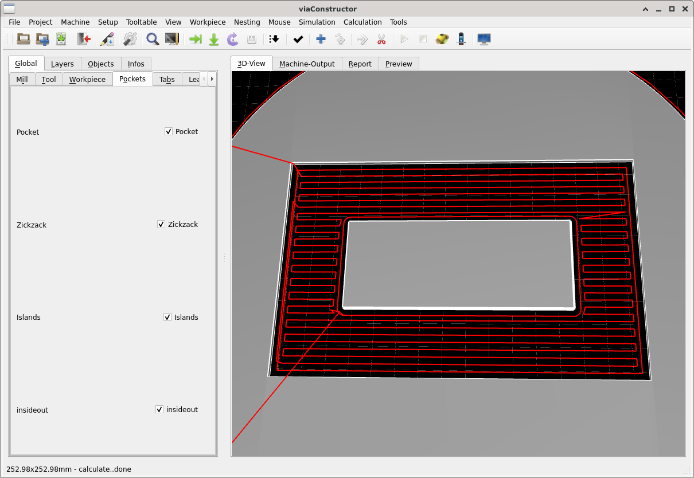

### insideout

from inside to out

* Default: True

## Tabs
### active

activate tabs

* Default: True

### Width

width of the tabs

* Unit: mm/inch
* Default: 10

### Height

height of the tabs

* Unit: mm/inch
* Default: 2

### Type

type of the tab

* Default: rectangle
### Options:
* rectangle
* triangle

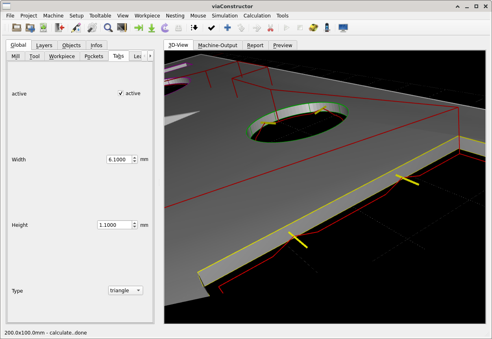

## Leads
### in-type

type of the lead-in's

* Default: off
### Options:
* off
* arc
* straight

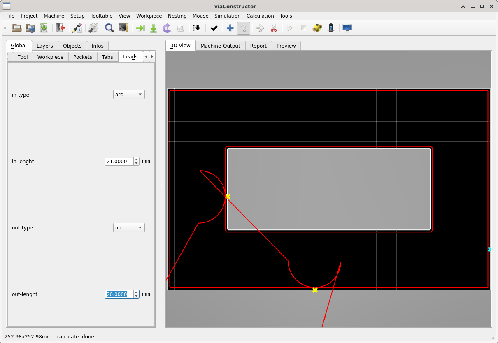

### in-lenght

lenght of the lead-in's

* Unit: mm/inch
* Default: 3.0

### out-type

type of the lead-out's

* Default: off
### Options:
* off
* arc
* straight

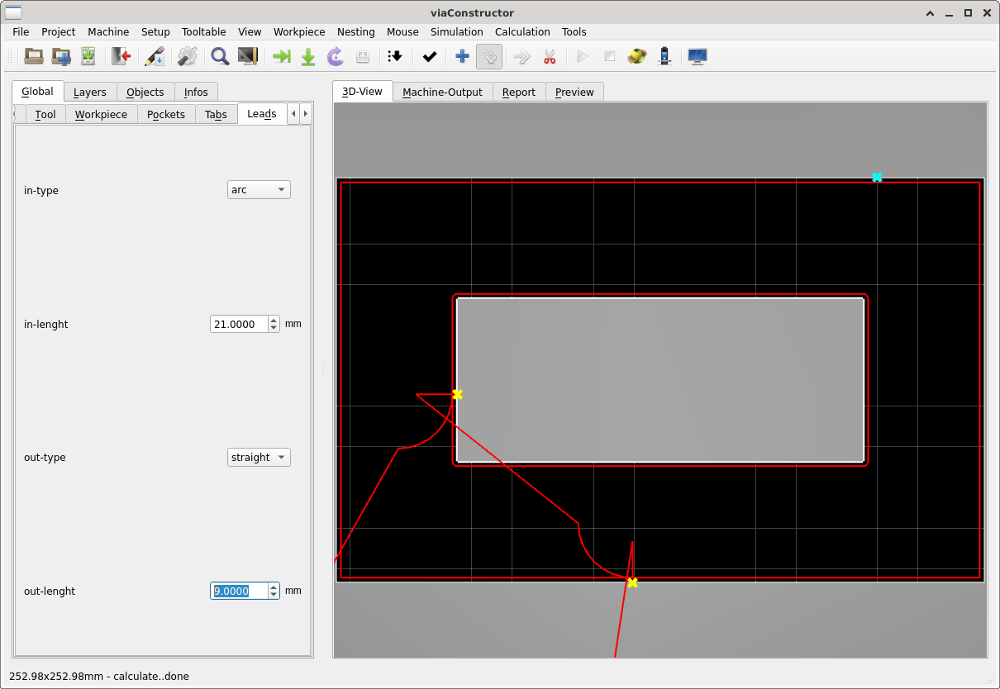

### out-lenght

lenght of the lead-out's

* Unit: mm/inch
* Default: 3.0

## Machine
### Feedrate

maximum feedrate while milling

* Default: 1000

### Tool-Speed

maximum tool-speed

* Default: 15000

### Plugin

output plugin selection

* Default: gcode_linuxcnc
### Options:
* gcode_linuxcnc
* gcode_grbl
* hpgl

### Tool-Mode

Tool-Mode

* Default: mill
### Options:
* mode
* laser
* laser+z

### Unit

Unit of the machine

* Default: mm
### Options:
* mm
* inch

### Arcs-Mode (G2/G3)

Arcs-Mode - G2/G3 with IJ or R (experimental)

* Default: ij
### Options:
* offset
* radius

### machine supports g54

machine supports g54 (workpiece offsets)

                    if true, workpiece offsets will set with G10 command:
                     G10 L2 P1 X10.000000 Y20.000000 Z3.000000 (workpiece offsets for G54)
                    if false, all offsets added to the G0-G3 commands
                

* Default: False

### extra init cmds

add gcode after init

* Default: 

### machine supports toolchange

machine supports toolchange

* Default: True

### toolchange pre cmd

add gcode before tool-change

* Default: 

### toolchange post cmd

add gcode after tool-change

* Default: 

### spindle on pre cmd

add gcode before turning the spindle on

* Default: 

### spindle off post cmd

add gcode after turning the spindle off

* Default: 

### Comments in output

add comments to output

* Default: True

### line numbers

adding line numbers

* Default: False

### add thumbnail to gcode

add thumbnail to gcode output (3d-view)

* Default: False

### Post-Command

Post-Command to do things after save like upload to cnc

* Default: 

## View
### Auto-Recalculation

update drawing automatically

* Default: True

### Autosave (Setup)

save setup as default automatically on exit

* Default: True

### Path

how to show the gcode path in the 3d-View

* Default: simple
### Options:
* minimal
* simple
* full

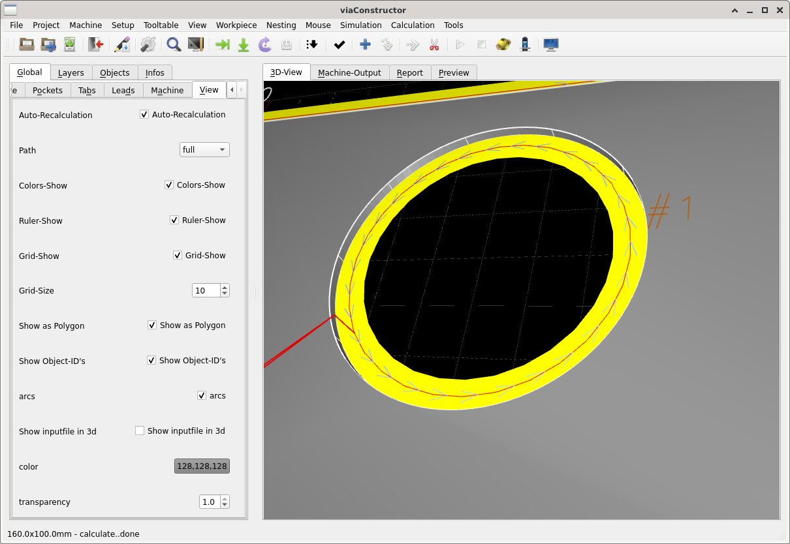

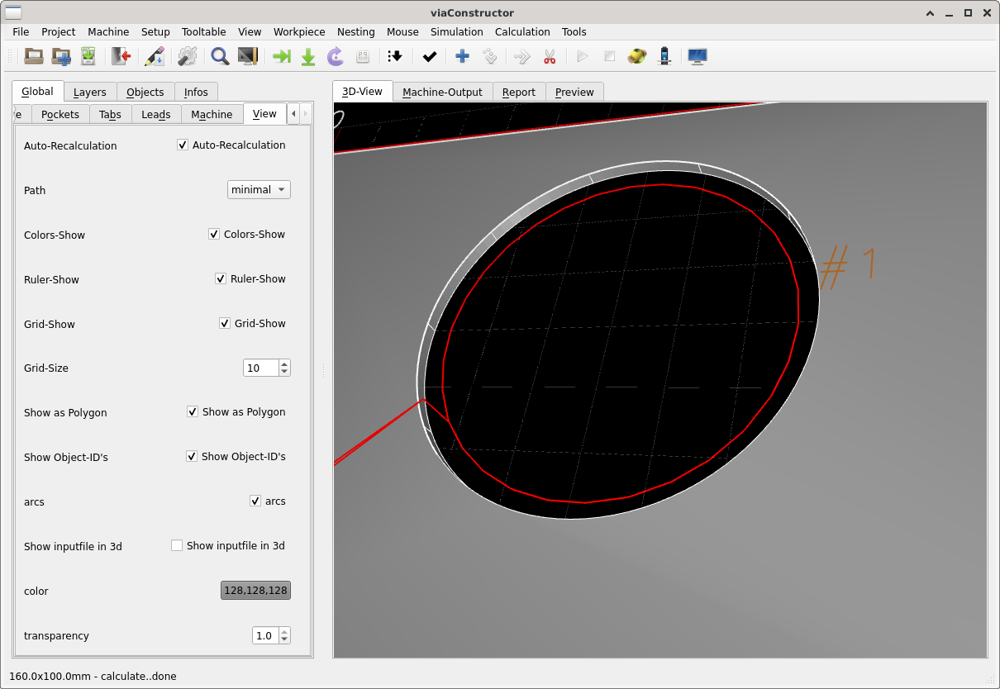

### Colors-Show

showing layer colors in 3D preview

* Default: True

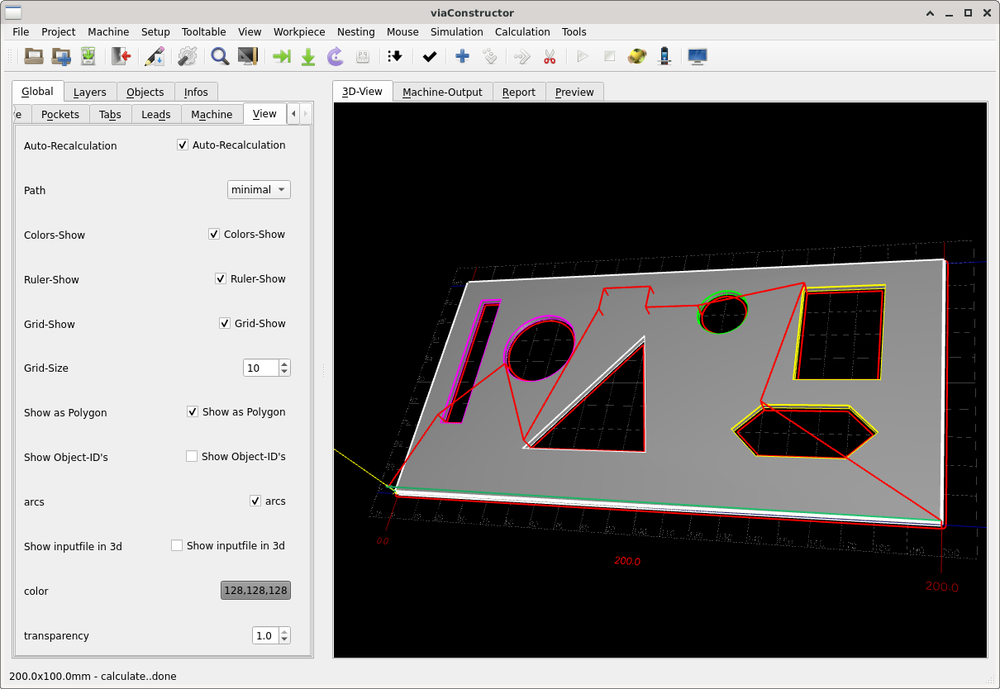

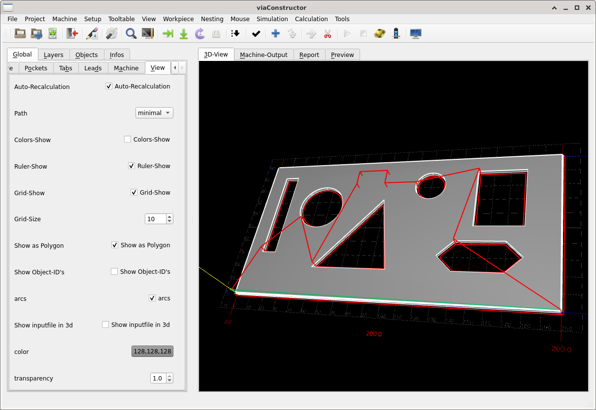

### Ruler-Show

showing ruler in 3D preview

* Default: True

### Grid-Show

showing grid in 3D preview

* Default: True

### Grid-Size

size of the grid

* Default: 10

### Show as Polygon

showing as polygon in 3D preview

* Default: True

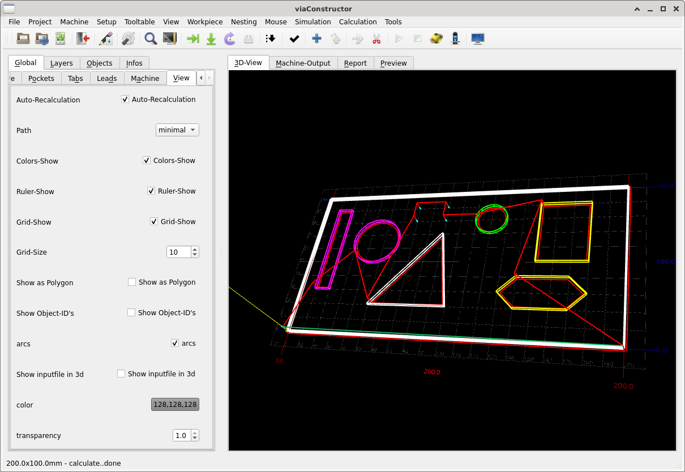

### Show Object-ID's

shows id of each object

* Default: True

### arcs

draw arcs / Interpolation

* Default: True

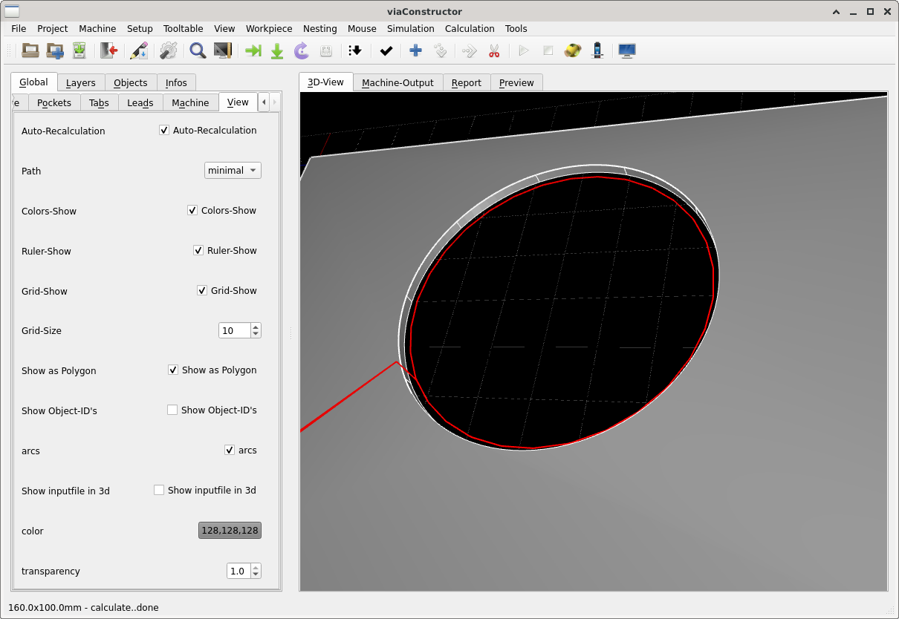

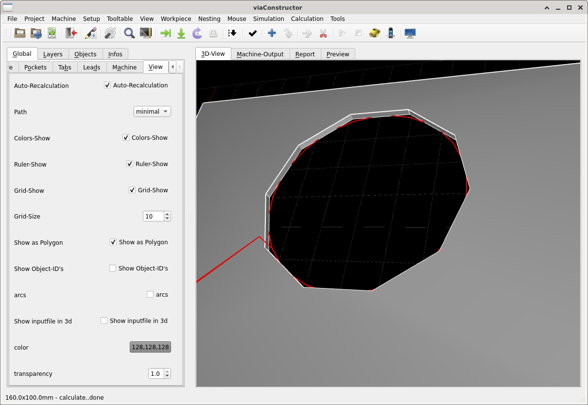

### Show inputfile in 3d

Show inputfile in 3d if possible

* Default: False

### color

color of the workpeace in 3d view

* Default: (0.5, 0.5, 0.5)

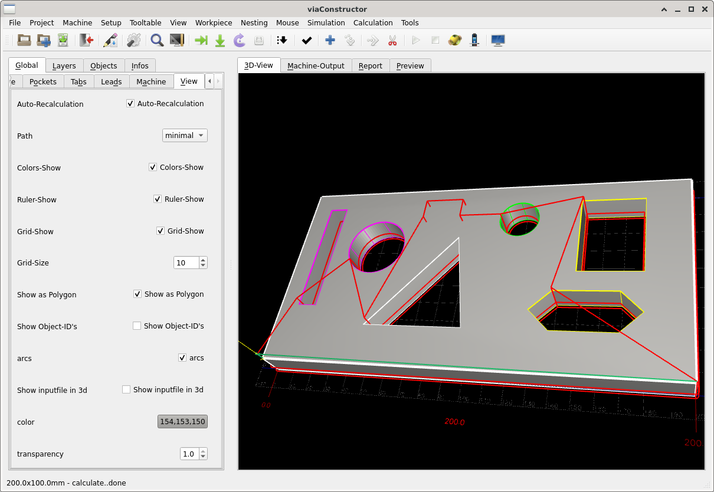

### transparency

transparency of the workpeace in 3d view

* Default: 0.6

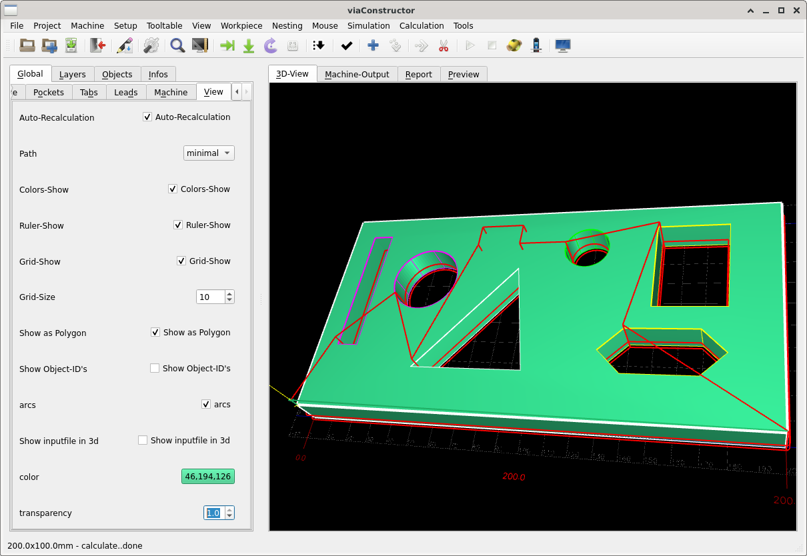

